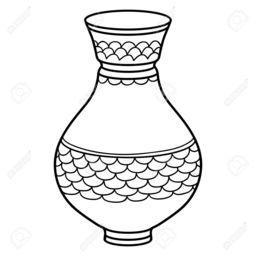
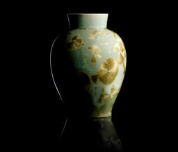
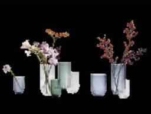
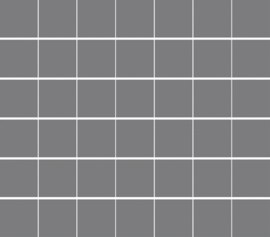

# Borges assessment results

## Pots vase/bowl classifier

I  trained this classifier on the 2000 given bowl/vase images, plus a collection of 1272 vase/bowl images crawled from google images.
All images were randomly scaled and rotated during training, to expand the number of training samples and ensure the classifier learns representative shape features.

### Results on Borges samples
I tested the classifier on 2000 previously unseen bowl/vase images generated through the borges api. This gave an accuracy of  94.9%.
10.2% of vase samples were classified as bowls, while *no* bowl samples were classified as vases.

#### Highest scoring correct samples for each class:

| Vase score 99.1%   |  Bowl score 100.0% |
|:-------------------------:|:-------------------------:|
  |   |

#### Worst misclassifications:

The 3 misclassifications (vases classified as bowls)  with the highest confidence are shown below:

| Bowl score 95.9%       |  Bowl score 92.8%      |  Bowl score 90.8%      |
|:----------------------------:|:----------------------------:|:---------------------------:|
|   |   |  |

You can see the misclassified vases are a bit atypical. The first one can hardly be called a vase at all (where would the flowers go).
The other two have bottoms that look very much like bowls. I suppose the top part of the vase got mistaken for the inside of a bowl.

### Results on Google images samples

I also tested the classifier on a previously unseen collection of 250 bowl and 250 vase images from google images. This only had an accuracy of 64.4%. 
Obviously this problem is much more challenging, and we would need a lot more data to train a proper generic classifier. 
Also I should note I didn't check all the images from google to see if they made sense.
Still, it works better than guessing!

#### Top correct classifications:

| Vase score 99.5%       |  Vase score 99.4%      |  Vase score 99.3%      |
|:----------------------------:|:---------------------------:|:----------------------------:|
|   |   |  |

| Bowl score 99.6%       |  Bowl score 99.6%      |  Bowl score 99.5%      |
|:----------------------------:|:--------------------------- :|:----------------------------:|
|   |   |  |

#### Top misclassifications:

| Bowl score 99.3%       |  Bowl score 99.0%      |  Bowl score 98.5%      |
|:----------------------------------:|:--------------------------------:|:---------------------------------:|
|   |   |  |

| Vase score 98.9%       |  Vase score 96.4%      |  Vase score 96.1%      |
|:----------------------------------:|:---------------------------------:|:---------------------------------:|
|   |   |  |

The vase classifier seems quite dependent on color; the top results are all grey-bluish, while the failures are a wide variety of colors.
One of the bowl classifier failures is not a bowl at all, and one of them is a top-down view, which is quite common and the classifier doesn't seem to support at all.

## Clay shape generator

I trained a GAN (generative adversarial network) to generate vase/bowl images. A GAN is actually two models, the generator and the discriminator. 
The generator creates images based on some input values (in this case I used the values from the .fields files).
The discriminator classifies images as real (coming from the trainingset) or fake (created by the generator).
Even though the generator never actually sees the trainingset images, it learns to create similar images based on the feedback from the discriminator (which it is trying to fool).

### Training

I trained one generator for the bowl and one for the vase class. For each, I had 3000 training samples (1k from the assessment and 2k generated from the api). 
The generator generates 64x64 pixel images (any larger is too difficult to train in a short period).

Below you can see random samples from the bowl and vase generator during each step of the training process:

You can clearly see the generator improving as it learns how to produce fake images.

### Generating

You can either use a `.fields` file as input (and it will try to recreate the described vase/bowl), or it can use random numbers and create something new-ish.
Finally you can interpolate between two existing `.fields` files

#### Random samples

Below are some randomly generated bowl and vase samples:

There's a good variety of vases and bowls on offer. A couple of images are just weird blobs. I suspect the randomly chosen values here were very far from any real `.fields` files, 
and a result the generator has not been trained on similar inputs and just has to make something up.

#### Comparison to Borges api

Below are some samples generated with a `.fields` file as input juxtaposed with the real image from the Borges api:

 
 
 
 

Some details are different, but overall it's pretty close!

#### Interpolated walk through fields space

Here we interpolate between successive fields files, and show the (mostly) smooth transitions:

